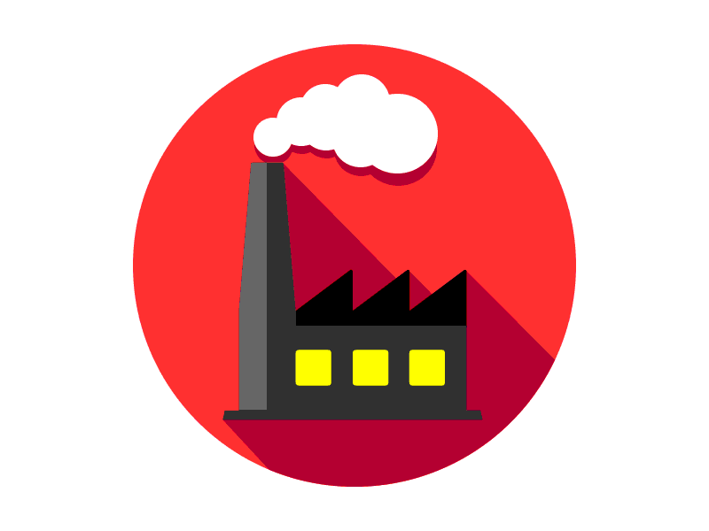

# `fabrik`

 

<code>fabrik</code> ist eine deutsche Übersetzung des beliebten Open-Source-Werkzeug <code><a href="https://github.com/danielmiessler/fabric">fabric</a></code> von Daniel Miessler 

# Just the Prompts

Fabrik is a German translation of the prompts from the popular [fabric](https://github.com/danielmiessler/fabric) tool by Daniel Miessler.
I'm not trying to duplicate the functionality of the application. I'm just interested in the excellent prompts. 
Please don't expect to find the original tools here!

Instead, I plan to simply host the prompts as static files in an NGINX server (in a separate project) in order to make them more accessible
for various use cases.

# Contribution

I would have preferred to contribute directly to the project, but I don't want to be forced to use the fabric application. I have other
purposes in mind for the prompts.

   